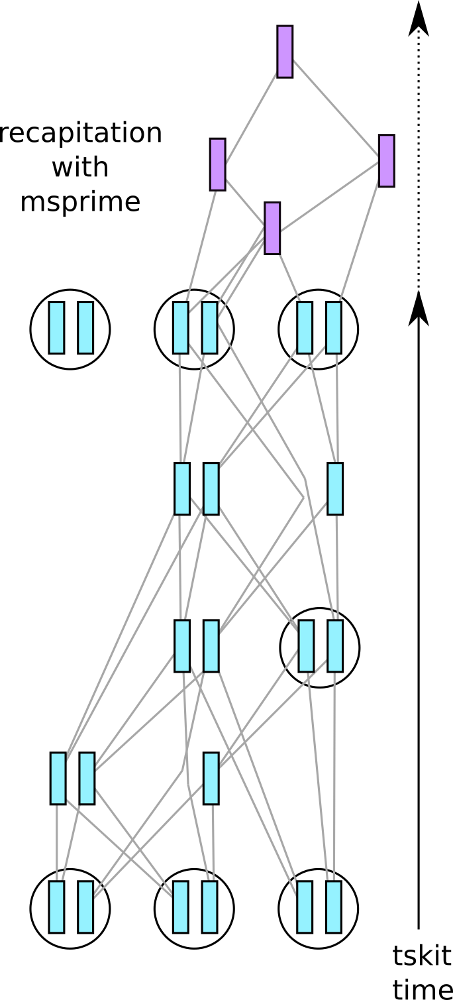
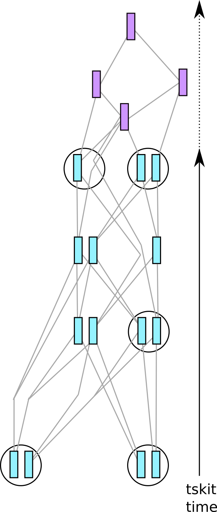
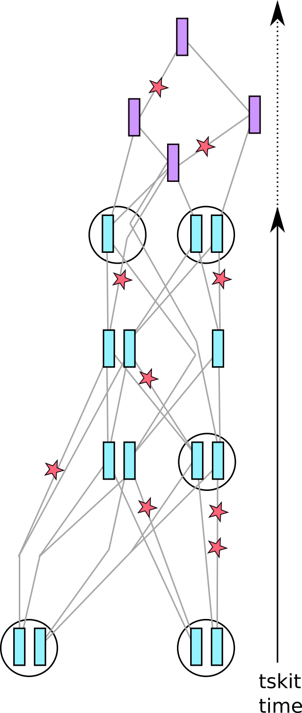

.. _sec_tutorial:

========
Tutorial
========

Coalescent simulation is more biologically limited, but is much faster than
forwards simluation, so it can be helpful to run a "hybrid" simulation, by
endowing a SLiM simulation with a history derived from a msprime simulation.
For instance, suppose we have a SLiM simulation of a population of 100,000 individuals,
that we have run for 10,000 generations without neutral mutations.
Now, we wish to extract whole-genome genotype data for only 1,000 individuals.
A typical way to do this would be to

1. :meth:`recapitate` : The simulation has likely not reached demographic equilibrium - it has not *coalesced* entirely;
   recapitation uses coalescent simulation to provide a "prior history" for the initial generation of the simulation.

2. :meth:`simplify` : For efficiency, subset the tree sequence to only the information relevant for those 1,000 individuals.
   This needs to come *after* recapitation.

3. :meth:`mutate` : This adds neutral mutations on top of the tree sequence.

These steps are described below.

************
Recapitation
************

Although we can initialize a SLiM simulation with the results of a coalescent simulation,
if during the simulation we don't actually use the genotypes for anything, it can be much
more efficient to only coalesce the portions of the first-generation ancestors that have
not yet coalesced. (See the SLiM manual for more explanation.)
This is depicted in the figure at the right:
imagine that the common ancestors of all samples did not exist at all sites within the
SLiM simulation. Recapitation starts at the *top* of the genealogies,
and runs a coalescent simulation back through time
to fill out the rest of genealogical history relevant to the samples.
The purple nodes are new ancestral genomes that have been added to the simulation.
This is important - if we did not do this,
then effectively the initial population would be genetically homogeneous,
and so our simulation would have less genetic variation than it should have
(since the component of variation from the initial population would be omitted).

Doing this is as simple as:

.. code-block:: python

   ts = pyslim.load("unfinished.trees")
   ts.recapitate(recombination_rate = 1e-6, Ne=1000)

Note that demography needs to be set up explicitly - if you have more than one population,
you must set migration rates or else coalescence will never happen
(see :meth:`SlimTreeSequence.recapitate` for more).

**************
Simplification
**************

In this example, we imagine that we have many more individuals in the simulation
than we actually want to analyze.
We can get rid of the extra information using an operation called *simplification*.
This is depicted in the figure at the right:
we have only retained information relevant to the genealogies of the remaining samples,
substantially simplifying the tree sequence.
While simplification sounds very appealing - it makes things simpler after all -
it is often not necessary in practice, because tree sequences are very compact,
and many operations with them are quite fast.
So, you should probably not make simplification a standard step in your workflow,
only using it if necessary.

Simplification to the samples of 1,000 individuals alive today
can be done with the :meth:`tskit.TreeSequence.simplify` method:

.. code-block:: python

   keep_indivs = np.random.choice(ts.individuals_alive_at(0), 1000)
   keep_nodes = np.fromiter([ts.individual(i).nodes for i in keep_indivs], dtype='int')
   sts = ts.simplify(keep_nodes)

**Note** that you must pass simplify a list of *node IDs*, not individual IDs.

*********************************************
Adding neutral mutations to a SLiM simulation
*********************************************

If you have recorded a tree sequence in SLiM, likely you have not included any neutral mutations,
since it is much more efficient to simply add these on afterwards.
To add these (in a completely equivalent way to having included them during the simulation),
you can use the :meth:`msprime.mutate` function, which returns a new tree sequence with additional mutations.
Continuing with the cartoons from above, these are added to each branch of the tree sequence
at the rate per unit time that you request.
This works as follows:

.. code-block:: python

   mut_ts = pyslim.SlimTreeSequence(msprime.mutate(sts, rate=1e-8, keep=True))

This will add infinite-sites mutations at a rate of 1e-8 per site, and will
``keep`` any existing mutations (and not add any new ones to the sites where they
exist already). We have wrapped the call to :meth:`msprime.mutate` in a call to
:class:`pyslim.SlimTreeSequence`, because :meth:`msprime.mutate` returns an *msprime* tree sequence,
and by converting it back into a ``pyslim`` tree sequence we can still use the methods
defined by ``pyslim``. (The conversion does not modify the tree sequence at all,
it only adds the ``.slim_generation`` attribute.) The output of other ``msprime``
functions that return tree sequences may be converted back to
:class:`pyslim.SlimTreeSequence` in the same way.

*********************
Reading SLiM metadata
*********************

Each ``Mutation``, ``Population``, ``Node``, and ``Individual`` carries additional information
stored by SLiM in its ``metadata`` property. The precise metadata stored in each is detailed in the SLiM manual.
For instance, to see the age of each Individual produced by annotation
in the previous example:

.. code-block:: python

   for ind in ts.individuals():
       print(ind.metadata.age)

In this example, all the ages are 0 (the default).

******************************
Coalescent simulation for SLiM
******************************

The :func:`pyslim.annotate` command helps make this easy, by adding default
information to a tree sequence, allowing it to be read in by SLiM. This will
simulate a tree sequence with msprime, add SLiM information, and write it out
to a ``.trees`` file:

.. code-block:: python

   import msprime
   import pyslim

   # simulate a tree sequence of 12 nodes
   ts = msprime.simulate(12, mutation_rate=0.0, recombination_rate=1.0, length=100)
   new_ts = pyslim.annotate_defaults(ts, model_type="nonWF", slim_generation=1)
   new_ts.dump("initialize_nonWF.trees")

Note that we have set the mutation rate to ``0.0``:
this is because any mutations that are produced will be read in by SLiM...
which *could* be a very useful thing, if you want to generate mutations with msprime
that provide standing variation for selection within SLiM...
**but**, currently msprime only produces mutations
with an infinite-sites model, while SLiM requires mutation positions to be at integer positions.
We `plan to fix this <https://github.com/tskit-dev/msprime/issues/553>`_,
but in the meantime you'll have to generate any pre-existing mutations by hand.
*However*, if you intend the pre-existing mutations to be *neutral*,
then there is no need to add them at this point;
you can add them after the fact, as discussed below.

The resulting file ``slim_ts.trees`` can be read into SLiM to be used as a starting state,
as illustrated in this minimal example::

   initialize()
   {
       setSeed(23);
       initializeSLiMModelType("nonWF");
       initializeTreeSeq();
       initializeMutationRate(1e-2);
       initializeMutationType("m1", 0.5, "f", -0.1);
       initializeGenomicElementType("g1", m1, 1.0);
       initializeGenomicElement(g1, 0, 99);
       initializeRecombinationRate(1e-2);
   }

   1 early() { 
       sim.readFromPopulationFile("initialize_nonWF.trees");
   }

   10 {
       sim.treeSeqOutput("nonWF_restart.trees");
       catn("Done.");
       sim.simulationFinished();
   }

See the SLiM manual for more about this operation.

**********************************
Possibly important technical notes
**********************************

Also known as "gotchas".

1. If you use msprime to simulate a tree sequence, and then use that to initialize a SLiM simulation,
    you have to specify the same sequence length in both: as in the examples above,
    the ``length`` argument to :py:meth:`msprime.simulate` should be equal to the SLiM sequence length *plus 1.0*.

2. ``tskit`` "nodes" correspond to SLiM "genomes".  Individuals in SLiM are diploid, so each has two nodes.

3. Since in SLiM, all individual are diploid, every individual will be associated with two nodes.
    The Individual table contains entries for 

    a. the currently alive individuals, 
    b. any individuals that have been remembered with ``treeSeqRememberIndividuals()``, and
    c. the *first* generation of the SLiM simulation.

    This last category is here because they are necessary for recapitation (described above);
    but they are *not* marked as samples, so will most likely be removed if you `simplify` the tree sequence.

********************
Things you cannot do
********************

Here are some things that you currently **cannot** do with ``msprime`` and SLiM.
They are all on our list to enable; but if you need something for your workflow
and would like to contribute, please open an issue to discuss.

1. You cannot generate mutations in msprime, and then use the tree sequence
    to initialize a SLiM simulation. This is because SLiM requires mutations
    to occur at integer positions, and msprime currently only generates
    mutations under the infinite-sites model.

2. You cannot use msprime to recapitate a SLiM simulation using a recombination
    map that is not uniform. This is because msprime and SLiM both use discrete
    recombination maps, but SLiM is discrete in physical coordinates (base pairs),
    while msprime is discrete in genetic map units. You *can* run a simulation in
    SLiM using any recombination map you want, and then recapitate using a uniform
    map in msprime (this is the default). See the `msprime documentation <https://msprime.readthedocs.io/en/latest/api.html#initialising-simulations-from-a-tree-sequence>`_
    for more discussion of recapitation.

